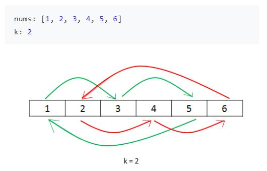

# One AC a Day Keep the Failure Away
!!! failure "人的一切痛苦,本质上都是对自己无能的愤怒"
    你看看你！因为不坚持刷算法题失去了多少机会！
    没能够去想去的地方！没能够拿到喜欢的实习！失败！自卑！不敢尝试！觉得自己没有准备好！一次次退缩！都是因为你的懒惰！畏惧！不能坚持！

!!! tip
    * 悟已往之不谏，知来者之可追
    * 驽马十驾，功在不舍
    * 贵有恒,何须三更起五更眠; 最无益,只怕一日曝十日寒。

!!! example "要求"
    * 每天至少AC一道题，不求多！！
    * 每周复习一次本周的题目
    * 不要死磕一道题！要学会不求甚解！！等到做题多了，再去总结共性！
    * 先掌握一种最容易理解的解法再说

!!! success "复习记录"
    

## Array
### [27. Remove Element](https://leetcode.com/problems/remove-element/)

!!! note "题意"
就地删除数组中和给定值相同的数字，返回新数组的长度。

!!! note "分析"
用后面的数来覆盖前面的数，可以达到就地删除目的。用指针$i$表示当前扫描到的位置，用指针$j$表示待覆盖的位置。首先我们手动算出最后的结果，看看待覆盖位置和扫描位置是怎么对应的。关键是想清楚指针怎么移动来实现这种对应关系。一开始两个指针都从0开始移动，当`nums[i] == val`时，$j$找到了待覆盖的位置不再移动，$i$继续移动，直到`nums[i] != val`, 此时执行覆盖`nums[j] = nums[i]` , 然后`j++` 。实际上，在还没找到待覆盖位置前，`i`和`j`都是同时移动的，`nums[j]=nums[i]`覆盖操作可以统一，不影响。

!!! note "代码"
```c++
class Solution {
public:
    int removeElement(vector<int>& nums, int val) {
        int cnt = 0;
        for(int i=0;i<nums.size();i++){
            if(nums[i] != val) nums[cnt++] = nums[i];
        }
        return cnt;
    }
};
```
!!! note "复杂度"
空间: $O(1)$ 时间: $O(n)$

### [26. Remove Duplicates from Sorted Array](https://leetcode.com/problems/remove-duplicates-from-sorted-array/)

!!! note "题意"
给定一个有序的数组就地删除重复项，使得每个数字最多出现1次，返回新数组长度

!!! note "分析"
强调有序是因为只有有序，重复项才可能集中在一起，而不是分散起来。快慢指针法：最开始时两个指针都指向第一个数字，如果两个指针指的数字相同，则快指针向前走一步，如果不同，则两个指针都向前走一步，(此时注意执行覆盖，手动模拟可以知道是慢指针后面一个被快指针覆盖，然后在两个指针+1，这个操作可以被统一成`nums[++j]=nums[i++]`)，这样当快指针走完整个数组后，慢指针当前的坐标加1就是数组中不同数字的个数。

!!! note "代码"
```c++
class Solution {
public:
    int removeDuplicates(vector<int>& nums) {
        int i = 0, j = 0, n = nums.size();
        while(i<n){
            if(nums[i] == nums[j]) i++;
            else nums[++j] = nums[i++];
        }
        return nums.empty() ? 0:(j+1);
    }
};
```

!!! note "复杂度"
空间: $O(1)$ 时间: $O(n)$

### [80. Remove Duplicates from Sorted Array II](https://leetcode.com/problems/remove-duplicates-from-sorted-array-ii/)

!!! note "题意"

给定一个有序的数组就地删除重复项，使得每个数字最多出现2次，返回新数组长度

!!! note "分析"

设置一个`cnt` 表示最多还可以重复多少次，这里初始化`cnt=1`。如果出现一次重复(`nums[i] == nums[j]`)，则`cnt--`，此时`cnt==0`。下次再重复时，快指针就向前一步。遇到不重复的情况，因为数组是有序的，所以一定没有重复数了，`cnt`再次恢复为1。需要注意两点：1.初始化`j=0,i=1` 2. 无论`nums[i]`和`nums[j]`是否相等，我们都要移动两个指针，那移动两个指针时，为了对两个不等的情况进行处理，所以还要加赋值操作，`nums[++i]=nums[j++]`。这个操作是对相等的情况是不影响的，可以统一。

!!! note "代码"

```c++
class Solution {
public:
    int removeDuplicates(vector<int>& nums) {
        int j = 0, i = 1, cnt = 1, n = nums.size();
        while(i<n){
            if(nums[i] == nums[j] && cnt == 0) i++; //用掉一次机会了，还出现相等就快指针移动
            else{ //还有机会
                if(nums[i] == nums[j]) cnt--;
                else cnt = 1; //出现不相等的，由于是有序，不可能后面有重复的了，现在是判断新的数字了，所以恢复
                nums[++j] = nums[i++];
            }
        }
        return nums.empty() ? 0:(j+1);
    }
};
```

!!! note "复杂度"

空间: $O(1)$ 时间: $O(n)$

### [189. Rotate Array](https://leetcode.com/problems/rotate-array/)

!!! note "题意"

就地旋转一个数组$k$次

!!! note "分析"

很容易想到的是利用同余的思想，用取模来求得第$i$个元素旋转$k$次后的位置。关键问题是如何实现就地，也就是不利用其他空间。
最好画图分析下，如下图所示


!!! note "代码"

```c++
class Solution {
public:
    void rotate(vector<int>& nums, int k) {
        k = k % nums.size();  //注意不要忘记这步，因为k可能大于size
        int cnt = 0;
        for(int i=0; cnt < nums.size(); i++){ //学习一下这种写法!没想到的!
            int j = i;
            int s = nums[i];
            do{
                j = (j + k) % nums.size();
                int t = nums[j]; //先保存target的值
                nums[j] = s; //再赋值为新的
                s = t; //然后再更新source值为原来位置上的target值
                cnt++; //标记已处理的元素个数，不能超过nums.size
            }while(j != i);  //直到回到原点
        }
    }
};
```

!!! note "复杂度"

空间: $O(1)$ 时间: $O(n)$

### [41. First Missing Positive](https://leetcode.com/problems/first-missing-positive/)

!!! note "题意"
就地寻找乱序数组中未出现的最小正数

!!! note "分析"
手动模拟：对数组`[3,4,-1,1]`来说, 如果长度为$n=4$的数组不缺失正数的话，应该为`[1,2,3,4]` , 即`nums[i]==i+1`，此时应该返回`n+1=5`。如果把`[3,4,-1,1]` 中的元素移动到它应该在位置，即`[1,-1,3,4]` 可以很方便看出缺失的正数是`2` , 因为在此处`nums[i] != i+1`。

所以可以从头到尾扫描数组, 把正数调整到正确的位置, 即`nums[i] == nums[nums[i]-1]`。再扫描数组，找到第一个`nums[i] != i+1`, 返回`i+1`, 否则返回`n+1`。

!!! note "代码"
```c++
class Solution {
public:
    int firstMissingPositive(vector<int>& nums) {
        int n = nums.size();
        for(int i=0;i<n;i++){
            while(nums[i]>0 && nums[i]<=n && nums[nums[i]-1] != nums[i]){
                swap(nums[i], nums[nums[i]-1]);
            }
        }
        for(int i=0;i<n;i++){
            if(nums[i] != i+1){
                return i+1;
            }
        }
        return n+1;
    }
};
```

!!! note "复杂度"
时间复杂度$O(n)$, 空间复杂度$O(1)$

