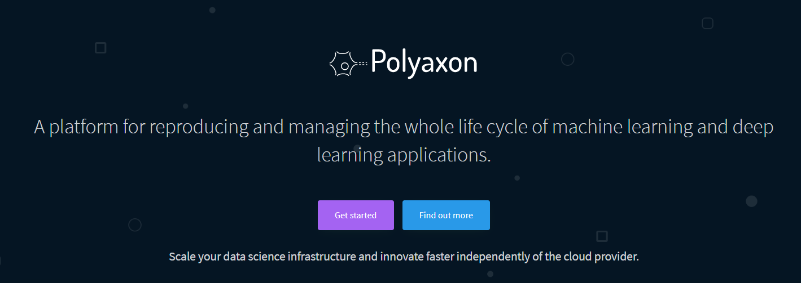
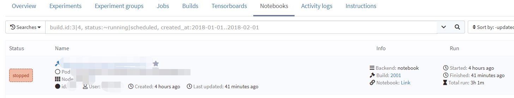
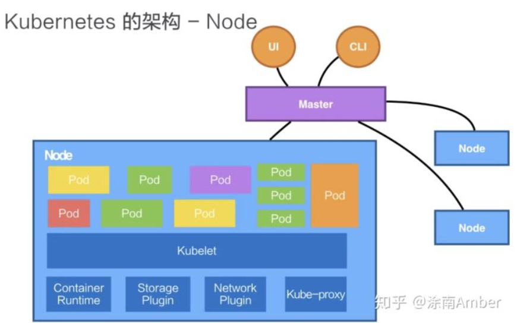

# 深度学习训练平台Polyaxon食谱

> 实验室的机器最近关掉了，只有用集群跑实验。搜集了很多资料，整理成了本文。旨在提供polyaxon的快速使用方法和一些关于docker，k8s的食谱。如何安装和部署polyaxon可以查看参考资料中的相关链接。推荐先跳到最后看参考资料部分的说明。



## Polyaxon 介绍

> A platform for reproducing and managing the whole life cycle of machine learning and deep learning applications.

这是来自官方文档的介绍。就我理解而言，polyaxon依靠k8s部署在集群上，可以自主分配需要集群资源，创建简单，可重复，可移植的部署，依靠docker定制运行环境，用于大规模深度学习和机器学习训练。

它提供了一些特性：调度多个实验或者多组实验(用于不同参数实验的比较或者大规模调参)，监控资源和状态，跟踪参数，日志，配置和标签，向用户报告指标，输出和其他结果。

同时，它还提供了一些超参数调优算法进行大规模调参，以及方便的Notebook，Tensorboard。


## 我们用Polyaxon来干嘛

我们可以通过Polyaxon上传本地代码到集群，然后通过写polyaxon配置文件，定制我们所需要的docker镜像，所需要的资源(内存，CPU，GPU)，以及实验类型(jupyter notebook, tensorboard 或者 普通实验)等选项来创建一个或者一组实验(运行在集群指定节点的一个个容器里面)，同时通过web界面的dashboard或者polyaxon-cli提供的众多命令监控资源和状态，跟踪参数，日志，配置和标签，以及最终的结果和输出等。



## k8s 介绍

Kubernetes (简称k8s) 将一个网络中的多个机器管理成一个集群，分为主节点(master)和其他节点(Node)。它可以把用户提交的容器(Container)放到其管理的集群的某一台节点(Node)上去，并根据容器大小规格自动调度并分配相应的资源。主节点负责管理所有节点的相关状态，下发给其他节点命令并执行等。

> K8s 的 Node 是真正运行业务负载的，每个业务负载会以 Pod 的形式运行。一个 Pod 中运行着一个或者多个容器，真正去运行这些 Pod 的组件的是叫做 kubelet，它接收到所需要 Pod 运行的状态，然后提交到 Container Runtime 组件中。  ----《从零开始入门 K8s| 阿里技术专家详解 K8s 核心概念》




另外一个需要了解的概念是volume (卷)。

>  它是用来管理 Kubernetes 存储的，是用来声明在 Pod 中的容器可以访问文件目录的，一个卷可以被挂载在 Pod 中一个或者多个容器的指定路径下面。----《从零开始入门 K8s| 阿里技术专家详解 K8s 核心概念》

容器实际一次运行结束后，除非将数据保存在永久存储卷中，否则数据会丢失。因此k8s将一定的本地存储空间挂载在容器中，成为一个可访问目录。容器运行时产生的数据可以存储在这个卷中。

接下来我们介绍k8s和polyaxon的联系。

polyaxon被部署在k8s上，使用polyaxon创建一个或者一组实验时，会根据配置文件创建一个或者多个容器由k8s实际调度运行在集群的某个或多个节点上。k8s负责其资源的调度，状态的监控等。也就是说，polyaxon实际提供了一个更加上层的接口，不需要用户自己执行任何k8s的命令来创建容器，创建Pod, 运行bash，输出状态信息等。这一切的一切都可以通过polyaxon完成。

正如上文所言，**polyaxon 要指定路径来进行持久存储(persistence storage)，不然实验数据和实验结果在容器运行结束后都无法保存了。因此，我们可以指定一台节点上的某几个文件夹作为挂载到容器的永久存储卷。**

这些文件夹在本地的路径以及容器上挂载的别名可以通过查看polyaxon`polyaxon-config.yml`得知


比如上图：定义了如下的持久存储卷（注：PVC: PersistentVolumeClaim）：

* `polyaxon-pvc-logs` （默认挂载为`logs` ) 用于保存实验的日志
* `polyaxon-pvc-repos` (默认挂载为`code`) ，上传的代码将保存在这里
* `polyaxon-pvc-data` （默认挂载为`data`），一些大数据集可以事先上传到这个文件夹中，故不需要在上传代码时费时上传很大的数据集
* `polyaxon-pvc-outputs` (默认挂在为`outputs`) , 实验的输出和模型断点保存在该文件夹中

## k8s 常用命令

k8s提供了`kubectl` 命令行工具对集群进行管理。我们可以登录master节点，利用该工具执行命令。

一些常用命令总结如下：

```bash
# 查看所有节点/Pod
$ kubectl get nodes/pods
# 查看指定节点/Pod的详细信息
$ kubectl describe nodes/pods [name]
# 在一个pod的运行的某个容器(如果只有一个，则省略-c部分)中获取shell
$ kubectl exec -it [pod-name] -c [container-name] -- /bin/bash
# 列出每个节点GPU的使用情况
# 目前无法列出具体GPU的编号，但是我认为这部分是由k8s管理起来了，即自动调度可用的GPU
$ kubectl describe nodes  |  tr -d '\000' | sed -n -e '/^Name/,/Roles/p' -e '/^Capacity/,/Allocatable/p' -e '/^Allocated resources/,/Events/p'  | grep -e Name  -e  nvidia.com  | perl -pe 's/\n//'  |  perl -pe 's/Name:/\n/g' | sed 's/nvidia.com\/gpu:\?//g'  | sed '1s/^/Node Available(GPUs)  Used(GPUs)/' | sed 's/$/ 0 0 0/'  | awk '{print $1, $2, $3}'  | column -t
# 显示目前GPU的情况：利用polyaxon的notebook执行nvidia-smi, 或者在运行的容器里面呼出shell, 或者使用polyaxon的gpu监测命令来监视GPU内存使用情况
```

接下来解释一下`kubectl describe nodes/pods [name]` 输出的信息。

```yml
# describe部分输出信息说明:
# Capacity: 容量; Allocatable: 可分配； Allocated：已分配
# cpu: 56 # cpu核心数
# cpu: 55900m # 100m=0.1个cpu核心，故这里指55.9个cores
# ephemeral-storage: 临时存储空间; 以字节为基本单位
# memory: 内存
# nvidia.com/gpu: 有/可分配gpu数
# hugepages-2Mi: 80Mi : 分配的大页面可以超过4KiB的默认页面大小，若分配大小超过为40个2Mi(共80Mi)的大页面则分配失败
# requests: 该node/pod/container需要的资源大小
# limits: 该node/pod/container最大可分配资源大小
# requests: 625m(1%) : 百分比例含义: 625m/55900m=1%
```

## Polyaxon 快速上手

```bash
$ pip install -U polyaxon-cli #安装polyaxon-cli
# 配置polyaxon
$ polyaxon config -l #列出当前配置
$ polyaxon config set --host=[ip] --port=[port]
# 登录
$ polyaxon login -u [username] -p [password] #注意如果是内网映射到外网，要设置终端代理
# 检查是否正运行与平台兼容的CLI版本
$ polyaxon version --cli
$ polyaxon version --platform
# 检查是否登录
$ polyaxon whoami
```

```bash
# 创建项目
#【example】
$ polyaxon project create --name=quick-start --description="Polyaxon quick start."
$ git clone https://github.com/polyaxon/polyaxon-quick-start.git
$ cd polyaxon-quick-start
# 使用在Polyaxon中创建项目时使用的名称初始化项目，并生成默认的配置文件polyaxonfile.yaml
$ polyaxon init quick-start --polyaxonfile
```

注：`polyaxon-cli` 是管理polyaxon的命令行工具，我们同样也可以通过web界面的dashborad来创建项目等。

接下来，我们需要写配置文件，描述实验，实验组，作业，插件应如何在Polyaxon上运行。

以下提供了一个示例`polyaxonfile.yaml`和相关解释

```yaml
version: 1 # 指定使用的polyaxon版本，无关紧要的参数，默认就好
kind: experiment # 操作的类型，除此之外，还有notebook，tensorboard，group等
environment:
  node_selector: # 选择集群中哪个节点来运行该实验
    kubernetes.io/hostname: gpu-a  # 节点名
  resources: # 要求的资源 (cpu,内存，GPU等)，一般是GPU
    gpu: # 注：在GPU调度中k8s要求requests和limits必须相同
      requests: 1 # 目前要求的
      limits: 1 # 最大限制
# 构建部分将构建一个docker映像，在本例中，我们希望使用指定的tensorflow docker映像运行我们的代码。我们还安装了用于跟踪和在实验结束时发送metrics的polyaxon-client
build:
  image: tensorflow/tensorflow:1.4.1-py3
  build_steps:
    - pip3 install polyaxon-client # polyaxon的python包
run: #执行代码
  cmd: python model.py
```

接下来即上传和运行代码

```bash
# update code
$ polyaxon upload
# start an experiment
$ polyaxon run
# 上面两条可以合成一条
$ polyaxon run -u
```

## Polyaxon 常用命令

```bash
# 列出该项目的所有实验
$ polyaxon project experiments

# 检查实验日志
$ polyaxon experiment -xp [exp-id] get

# 开始另一个实验
$ polyaxon run -f [实验配置文件.yaml]

# 开始一组实验（比如调参时用）
# 检查实验配置文件是否有效
$ polyaxon check -f polyaxonfile_hyperparams.yaml --definition
# 开始一组实验
$ polyaxon run -f polyaxonfile_hyperparams.yaml
# check这组实验的相关信息
$ polyaxon group -g [group-id] get # 这个组的整体信息
$ polyaxon group -g [group-id] experiments # 这个组的所有实验的信息
$ polyaxon group -g [group-id] experiments -m # 这个组所有实验的metric
$ polyaxon group -g [group-id] experiments -p # 这个组所有实验的参数

# 过滤指定信息
$ polyaxon group -g [group-id] experiments -m -q "status:succeeded, params.activation:relu|sigmoid, metrics.loss:<=0.3"

# Dashboard
$ polyaxon dashboard

# tensorboard
# 可以为一个单独的实验，一个小组的所有实验，或者一个项目的所有实验启动一个tensorboard
$ polyaxon tensorboard -xp [exp-id] start -f [tensorboard配置文件]
$ polyaxon tensorboard -xp [exp-id] stop

# notebook
$ polyaxon notebook start -u -f [使用的配置文件路径]
$ polyaxon notebook stop
```

命令及其参数有很多，具体可以使用`--help `查看帮助

比如`polyaxon notebook start --help`

## Polyaxon YAML填写规范

要确保polyaxon文件有效，可以运行以下命令检查

```bash
$ polyaxon check -f polyaxonfile.yaml -def
```

下面提供两种常见的写法

```yaml
version: 1 # Represents the polyaxon file specification version. 不用管就是
kind: experiment # 操作的种类: experiment, group, job, notebook, tensorboard, pipeline
logging:
  level: INFO  # log level
  formatter: # The log formatter regex.
environment:
  node_selector: # 选择指定节点
    kubernetes.io/hostname: gpu_a
  resources:
    cpu:
      requests: 1
      limits: 2
    gpu:
      requests: 1
      limits: 1
params:
  batch_size: 128
  convolutions:
    conv1:
       kernels: [32, 32]
       size: [2, 2]
       strides: [1, 1]
    conv2:
       kernels: [64, 64]
       size: [2, 2]
       strides: [1, 1]
build:
  image: http://[私有仓库ip]/nvidia/pytorch:20.01-py3 #可以使用公共镜像也可以使用实验室私有的
  build_steps:
    - pip install PILLOW
    - pip install scikit-learn
  # dockerfile: path/to/Dockerfile 通过dockerfile构建全新的镜像，而不通过指定现有的镜像
run:
  cmd: python model.py --conv1_kernels="{{ convolutions.conv1.kernels }}" --conv1_stides="{{ convolutions.conv1.strides }}" --batch-size={{ batch_size }}
```

另一种是预先声明了传入参数的类型，使得在通过`polyaxon-cli`运行该实验时，可以先验证参数合法性，如果不通过，则不会运行该实验。

```yaml
version: 1

kind: experiment

inputs:
  - name: batch_size
    description: batch size
    is_optional: true # 是否可选
    default: 128
    type: int
  - name: num_steps
    is_optional: true
    default: 500
    type: int
  - name: learning_rate
    is_optional: true
    default: 0.001
    type: float
  - name: dropout
    is_optional: true
    default: 0.25
    type: float
  - name: num_epochs
    is_optional: true
    default: 1
    type: int
  - name: activation
    is_optional: true
    default: relu
    type: str


build:
  image: tensorflow/tensorflow:1.4.1-py3
  build_steps:
    - pip3 install --no-cache-dir -U polyaxon-client==0.5.0

run:
  cmd:  python3 model.py --batch_size={{ batch_size }} \
                         --num_steps={{ num_steps }} \
                         --learning_rate={{ learning_rate }} \
                         --dropout={{ dropout }} \
                         --num_epochs={{ num_epochs }} \
                         --activation={{ activation }} 
```

更多使用方法可以查看官方文档。

## 参考资料

> 笔者初接触docker，k8s和polyaxon平台，行文仓促且拙劣。本文仅整理一些常用的命令方便日后使用，介绍部分有很多遗漏和谬误，还望原谅和指正。在成文过程中参考了以下资料，比起笔者写的这篇文章而言，我更推荐大家去阅读这些资料 TUT

### Docker部分

* 介绍Docker

[8 分钟入门 K8s | 详解容器基本概念 - 知乎](https://zhuanlan.zhihu.com/p/82673474)  （强烈推荐）

[这可能是最为详细的Docker入门吐血总结](https://mp.weixin.qq.com/s/a5fnVpXH1xCtgXHu6jg1LQ)

[如何通俗解释Docker是什么？ - 知乎](https://www.zhihu.com/question/28300645) (强烈推荐)

[在 Windows 上可以用 Docker 吗？ - 知乎](https://zhuanlan.zhihu.com/p/47007846) (强烈推荐)

[终于有人把 Docker 讲清楚了，万字详解！ - 知乎](https://zhuanlan.zhihu.com/p/89587030)

[关于 Windows 容器 | Microsoft Docs](https://docs.microsoft.com/zh-cn/virtualization/windowscontainers/about/)

[深挖 Docker 之 Linux namespace 和 cgroups - 知乎](https://zhuanlan.zhihu.com/p/55099839)

* 兼顾Docker介绍和实战

[Docker -- 从入门到实践](https://docker_practice.gitee.io/zh-cn/introduction/what.html) (强烈推荐)

### k8s 部分

* k8s介绍

[合集| 21 篇技术文章，带你从零入门 K8s-阿里云开发者社区](https://developer.aliyun.com/article/743581?spm=a2c6h.12873581.0.dArticle743581.5fa67478gyyzZi&groupCode=alisoftwaretech)  （强烈推荐）

[从零开始入门 K8s| 阿里技术专家详解 K8s 核心概念 - 知乎](https://zhuanlan.zhihu.com/p/83177650) (强烈推荐)

* k8s 使用

[获取一个运行容器的 Shell | Kubernetes](https://k8smeetup.github.io/docs/tasks/debug-application-cluster/get-shell-running-container/)

[Kubernetes之kubectl命令行工具简介、安装配置及常用命令](https://blog.csdn.net/bbwangj/article/details/80814568)

[常用kubectl命令总结 - Federico - 博客园](https://www.cnblogs.com/Cherry-Linux/p/7866427.html)

[调度 GPUs - Kubernetes](https://kubernetes.io/zh/docs/tasks/manage-gpus/scheduling-gpus/#)

[Kubernetes 官方文档](https://kubernetes.io/docs/) (强烈推荐)

### k8s 部署 Polyaxon

[使用kubeadm建立kubernetes集群并部署Polyaxon详细教程](https://blog.csdn.net/yuguo7336761/article/details/81150152)  (强烈推荐)

### Polyaxon 官方文档

[入门介绍和Quick-Start](https://docs.polyaxon.com/concepts/introduction/)  (强烈推荐)

[Polyaxon YAML 规范 ](https://docs.polyaxon.com/references/polyaxonfile-yaml-specification/)  (强烈推荐)

[Polyaxon命令行管理工具](https://docs.polyaxon.com/references/polyaxon-cli/)


